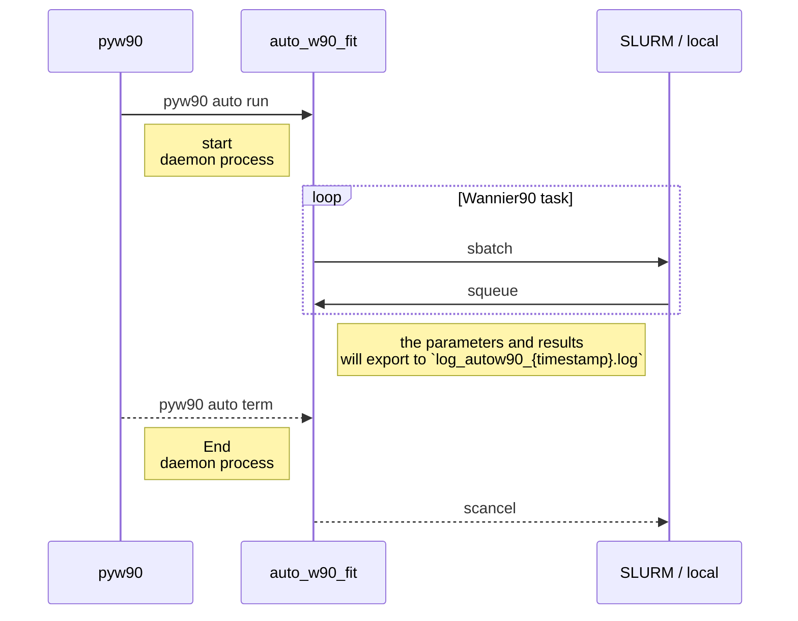

<table align="center"><tr><td align="center" width="9999">

# pyw90

A `VASP` and `Wannier90` interfaced tool for projection analysis and fully automated dis energy window optimization

</td></tr></table>


## Key features

1. Display the distribution of eigenvalues.
2. Pre-analysis before the `Wannier90` interpolation with projection and dis energy window recommendations.
3. Auto Wannier90 Fit. Using minimization method to choose the most appropriate dis energy windows. 
4. Comparison. Evaluate the differences between the `VASP` and `Wannier90` band structure.

## Installation via `pip`

Install `pyw90` using `pip.

```bash
pip install pyw90
# update the package
pip install pyw90 --upgrade
```

The dependencies for `pyw90` are listed below:

- python (>= 3.8, < 3.12)
- pymatgen
- scipy (>= 1.8)
- numpy (>= 1.20.1)
- python-yaml (PyYAML)
- pandas
- matplotlib (>=3.4)

## Contributing

Issues and pull-requests are welcome.

## Usage

After installing `pyw90`, you could use command line to line it. 
To access help message, please use `pyw90 -h`. 
In submenus, you can also use `-h` (e.g., `pyw90 auto -h`).

```
usage: pyw90 [-h] {eig,pre,auto,cmp} ...

Command-line toolbox interfaced between VASP and Wannier90. You can also use -h
to display the submenu help message. e.g., pyw90 pre -h

positional arguments:
  {eig,pre,auto,cmp}  Menus
    eig               Display the distribution of eigenvalues and dis energy
                      window recommendations.
    pre               (Pre)-analysis before `Wannier90` interpolation:
                      generation of `Wannier90` input and improved dis energy
                      window recommendations based on projected density of
                      states.
    auto              (Auto Wannier90 Fit) Using minimization method to choose
                      the most appropriate dis energy windows.
    cmp               (Comparison) Evaluate the differences between the `VASP`
                      and `Wannier90` band structure.`bnd.dat` for VASP band
                      data in `p4vasp` format and `wannier90_band.dat`,
                      `wannier90_band.labelinfo.dat`,and `wannier90.wout` are
                      required for plotting and analysis.

optional arguments:
  -h, --help          show this help message and exit
```

### 1. `eig` Menu

This menu provides you an overview of the entire distribution of eigenvalues. 
These information may assisit you in determining the `exclude_bands` block in `Wannier90` and the outer window `dis_win_min` and `dis_win_max`.

The help message of `eig` menu is listed below.

```
usage: pyw90 eig [-h] [-e ERANGE ERANGE] [--config] [--path PATH] [-i EIG]
                 [--rm-fermi] [--efermi EFERMI] [-w NWANN] [-n NBNDS_EXCL]
                 [--deg DEG] [--plot] [--separate] [--eps EPS]
                 mode

positional arguments:
  mode              Mode: dist, count, suggest. Only the first character is
                    recognized.

optional arguments:
  -h, --help        show this help message and exit
  -e ERANGE ERANGE  Energy ranges. Default: [-1e3, 1e3]
  --config          Read input from config file `auto_w90_input.yaml` directly.
                    Default: False
  --path PATH       The path of working dir. Default: .
  -i EIG            Select `wannier90.eig` file or `EIGENVAL` file. Default:
                    EIGENVAL
  --rm-fermi        Control whether the input energy ranges `erange` has removed
                    the non-zero Fermi level. Default: False
  --efermi EFERMI   Fermi level. Default value is generated from `vasprun.xml`.
  -w NWANN          Total number of Wannier Functions. Default: 0
  -n NBNDS_EXCL     Total number of ignored bands beginning with the lowest KS
                    band.
  --deg DEG         Total number of band degeneracy. Default: 1
  --plot            Control whether the distribution is output as a figure or
                    not
  --separate        Control calculate bands separately
  --eps EPS         Tolerance for dis energy window recommendations. Default:
                    0.004
```

The `dist` mode displays the distribution of eigenvalues 
and allows you to either generating figure named `dos_analysis.pdf` 
or print the results directly  to the terminal. Here is an example for GaAs. 
The starting band index is indicated by the label above the bar plot and the Fermi level has been set to 0.


In `count` mode, the code can determine how many states exist at least and at most for each k-point within the given energy ranges `erange`. 
And the `suggest` mode is used to provide dis energy window recommendations. 

The data is extracted from the `EIGENVAL` file or `wannier90.eig` file.
You could directly input the absolute or relative path to the file using the `-i` argument, 
or you could specify its location folder through the `-path` argument.
Using the `-e` argument, the output energy ranges can be controlled both in printing and figure.
It is also possible to use the `-e` argument to calculate the number of states existed within the given energe ranges and provide recommendations for the `dis_win_min` and `dis_win_max` values.
This requires the `-w` argument passes non-zero number of Wannier functions (#WFs) to the code. 

We read the data from the `EIGENVAL` file without modification.
Therefore, the Fermi level for most materials is typically non-zero.
If you add the argument `—rm-fermi`, the code will consider Fermi level to be 0.
This will affect the energy ranges obtained from `-e` argument.
The default Fermi level is read from the `vasprun.xml` file located in the `—path` directory.
Within the `—efermi` argument, you can also explicitly state a different number to become Fermi level. 

Other arguments and parameters:

- `-n NBNDS_EXCL`. Total number of ignored bands beginning with the lowest KS band. These bands will be hidden in 'dist' mode.
- `--deg DEG`. Band degeneracy. Please enter `--deg 2` to account for the degree of spin freedom when counting Wannier functions. The default value is 1.
- `--eps EPS`. Due to the insufficient sampling in the Brilliouin zone as well as the numerical error, the number of states within the energy ranges may be underestimated. This may result in the failure of `Wannier90`. Therefore, we change the final dis energy windows by substracting or adding `eps` to the band minimum and band maximum respectively.

**Among all the features, the dis energy recommendation is the key feature of the `eig` menu.**
To activate the outer window recommendation, please use `suggest` mode.
We obtain all potential `dis_win_min` values from the mid-point of the global gap below Fermi level. During this step, there is no extra
With the extra argument `-w` (#WFs), the code would provide the `dis_win_max` values by counting the number of states inside the energy ranges. 
Because `Wannier90` demands there ought to be at least as many states as #WFs for each kpoints. 
During this step, we only present the `dis_win_min` for which the band minimum is greater than the lower limit of energy ranges and the number of states between `dis_win_min` and Fermi level is less than #WFs.

We can also use `-w` argument (without input, the default value of #WFs is 0) for inner window recommendation.
All recommended `dis_win_min` values $E_{\text{wmin}}$ obtained above are also utilizied as `dis_froz_min` for generating possible `dis_froz_max`. 

The first step in generating `dis_froz_max` is to count how many states there are, at a minimum, over all k-points in Brilliouin zone. 
The energy ranges here is consisted of $E_{\text{wmin}}$ and $E_2$, which is the upper limit of given energy ranges $(E_1, E_2)$ from arguments. 
We assume there are $N>N_{\text{WF}}$ states at least in this energy ranges. 

Then the code will generate $E_{\text{fmax}}$, upper bound of new `dis_win_max`, with at most $N_i = N_{\text{WF}} + i$ states inside the energy ranges $\left(E_{\text{wmin}}, E_{\text{fmax}}\right)$. 
Here $i=1,2,\cdots, N-N_{\text{WF}}$.
And then the same method is then utilized to construct the lower bound of new `dis_froz_min` as well by searching $E_{\text{fmin}}$ matching at most $N_{\text{WF}}$ states in energy ranges $\left(E_{\text{fmin}}, E_{\text{fmax}}\right)$.
This approach guarantees the generated dis frozen energy window satisfying the requirement of `Wannier90` that there are at most $N_{\text{WF}}$ states inside. 

However, owing to the presence of degenerate points, such a straightforward approach might omit some vital frozen energy windows.
This is resulted by substracting `eps` from the band maximum, which is also the degenerate points.
With the occurance of additional states, the iteration over all states within energy ranges become discontinous and the obtained `dis_froz_min` will skip several bands and states.

To prevent the problem described above, we include an additional check to see whether there are skipped states between the input $E_{\text{wmin}}$ and $\min E_{\text{fmin}}$, the minimum of all `dis_froz_min`. 
If there are $\Delta N$ skipped states, we will re-examine number of Wannier functions with

$$
N'_{\text{WF}}=N_{\text{WF}}-1, \cdots, N_{\text{WF}}-\Delta N
$$

to produce potential dis frozen energy windows.

### 2. `pre` Menu

This menu offers some basic `Wannier90` input and improved dis energy
window recommendations based on projected density of states. The help message of `pre` menu is provided as below.

```
usage: pyw90 pre [-h] [--path PATH] [-e ERANGE ERANGE] [--lb LB] [--rm-fermi]
                 [--extra EXTRA] [--spin-down] [--plot] [--eps EPS] [--deg DEG]
                 mode

positional arguments:
  mode              Mode: kpath, band, template, dos. Only the first character
                    is recognized.

optional arguments:
  -h, --help        show this help message and exit
  --path PATH       The path of working dir. Default: .
  -e ERANGE ERANGE  Energy range. Default: [-1e3, 1e3]
  --lb LB           Lower bound for selected orbital / max single orbital.
                    default: 0.1
  --rm-fermi        Control whether the input energy ranges `erange` has removed
                    the non-zero Fermi level. Default: False
  --extra EXTRA     Extra input. In `template` mode and within extra input
                    (basic, wann, band), we can choose one of the detailed parts
                    to print.In `dos` mode and within extra input (`species`,
                    `structure_id`, `orbital_id` list separated by ;), we can
                    treat input as projections for `Wannier90` input to suggest
                    dis frozen energy. Details can be found in the document.
  --spin-down       Specify the spin channel to `Spin.down`. Without this
                    argument, the default spin channel is `Spin.up`.
  --plot            plot the dos distribution
  --eps EPS         Tolerance for dis energy window recommendations. Default:
                    0.004
  --deg DEG         Degeneracy of bands. Default: 1

```

Different input parts are provided by **the `kpath`, `band` and `template` modes** for `Wannier90`.

- `kpath` : Converting the line-mode `KPOINTS` file from `VASP` to `Kpoint_Path` block in `Wannier90`.
- `band` : Converting `VASP` band structure into a p4vasp-type $k-E$ `.dat` file.
Default file name is `bnd.dat`. If the system has two spin channels, the band data will be exported into two separate files named `bnd_up.dat` and `bnd_down.dat`.
- `template` : Print the input template for `Wannier90`, which includes the `seedname.win` file format, the dis energy window block, and the band structure calculation block. 

**The `dos` mode is the most important feature of `pre` menu.** From the first-principle calculation in VASP with `LORBIT=11`, `vasprun.xml` are written with decomposed orbital projection information.
> For further details, see [LORBIT - Vaspwiki](https://www.vasp.at/wiki/index.php/LORBIT).

In order to describe the band structure `VASP` in a way that is both precise and comprehensive (especially for topological semimetal), `Wannier90` has to select projections that is both accurate and thorough.
Here, we compare the projected density of states (pDOS) to the total density of states (tDOS) and offer recommendations of inner energy ranges `dis_froz_min(max)` based on the pDOS / tDOS ratio. 

You must specify the folder where `VASP` results are stored by using `--path` argument when using the `kpath` and `band` modes.
The current working directory is used as default. In `template` mode,
All of the `Wannier90` input templates will be printed by default. 
You can also enter the keywords `basic`, `wann` and `band` to print
basic structure of `seedname.win`, dis energy window block, and the band structure calculation block correspondingly.

While the code running in `dos` mode, you must also specify the path of the `vasprun.xml` file by using `--path` argument
The pDOS distribution of each orbital each atom can be determined below with energy ranges $(E_1, E_2)$ obtained from `-e` argument.
The `--rm-fermi` argument is used if the input energy ranges `erange` assumes the eigenvalues has already removed the non-zero Fermi level.

$$
\text{pDOS} = \int_{E_1}^{E_2} \text{dos}_{\text{atom, orb}}(E)\,\mathrm{d}E
$$

The output of pDOS is presented as a table with columns containing: `species`, `structure_id`, `orb_id`, `orb_name`, `key_string` and `dos`. 
The `structure_id` is obtained from `vasprun.xml` (also same as listed in `POSCAR`) with index beginning at $0$. The `orb_id` and `orb_name` use the notation in pymatgen (same as `VASP` in old version). 

> For further details, see note at the end of the section.

The `key_string` is formatted with `species`, `structure_id` and `orb_name` (e.g. `Ga_0_px`). The dos column is calculated from above formula. 
Since we are only interested in the relative comparisons of pDOS, the maximum value of `dos` column is normalized to $1$.

The lower bound specified by the `lb` argument is used to determine the most representative projections.
The orbitals and sites are used as the `projection` block for `Wannier90` input only when the `dos` column values is greater than `lb`. 
As soon as the projections are picked upon, the total number of Wannier functions is also determined. 
The results are presented in a table with `species`, `site` and `orb` columns.
The default value for the `site` column is the `structure_id` mentioned above.
You might encounter the value in `site` column becomes -1 instead of other non-negative integers.
This is because we further simplify the selection information by unifying the case when orbitals are located at one site and all sites of the same species have the same orbitals.

The projection Information will be transformed into Wannier90's `projection` block format. 
For further usage, it will also be written in `key_string` format for `pyw90` input with replacing the orbital name to orbital index. By default, a comma separates keys within the same species, whereas `;` separates keys from different species. (e.g., `Ga,0,1-3;As,1,1-3` represents choosing the p orbital of Ga and As)

Our pDOS-based dis frozen window recommendation will be shown if the user specifies `--extra` while running in `dos` mode and provides explicit energy ranges.
Columns for `dis_froz_min`, `dis_froz_max`, `N`, `pdos`, `tdos` and `percent` will be presented in the output. The values of `percent` column is pDOS / tDOS ratio.
The entire table is sorted acordding to the value of pDOS percentage.
We can treat the highest percentage as the initial guess for `Wannier90`.

In addition, the code also computes the minimum value of `dis_win_max`.

**Note:**

The notation of orbitals has varied a lot between different softwares and differernt versions.
The notation for `pyw90` and `pymatgen` (2022.8.23) is identical. Notations for all orbitals are listed below:

```bash
# pymatgen 2022.8.23
s 
py   pz   px
dxy  dyz  dz2  dxz  dx2
f_3  f_2  f_1  f0   f1   f2  f3

# VASP 5.4.4
s
py     pz    px 
dxy    dyz   dz2   dxz  x2-y2
fy3x2  fxyz  fyz2  fz3  fxz2   fzx2  fx3

# Wannier90
s
pz   px    py
dz2  dxz   dyz   dx2-y2     dxy
fz3  fxz2  fyz2  fz(x2-y2)  fxyz  fx(x2-3y2)  fy(3x2-y2)
```

### 3. `auto` Menu

**This menu enables you do fully automated dis energy optimization** and the `auto` menu help message is listed below.

```
usage: pyw90 auto [-h] [--path PATH] [--pid PID] mode

positional arguments:
  mode         Mode: run, term(inate), input. Only first character is
               recognized.

optional arguments:
  -h, --help   show this help message and exit
  --path PATH  The path of working dir. Default: .
  --pid PID    PID to terminate.
```

If the code is executed with the `input` mode, it will generate the configuration file `auto_w90_input.yaml` in the directory specified by the `--path` option.
This file contains all the necessary inputs for `Wannier90` to function properly, including the initial dis energy window in `Wannier90`, minimization parameters, running and display settings.
Since other menus share same parameters in config file, and the `--config` option has been added to other menus so that data can be extracted directly from the file.

In `run` mode, the `Wannier90` task can be executed automatically using the SLURM job system or by running the job locally. The quality of `Wannier90` result is evaulated from

$$
\Delta=\frac{1}{C} \frac{1}{N_{\mathbf{k}}} \sum_{i=1}^{M} \sum_{\mathbf{k}}\left|\varepsilon_{i, \mathbf{k}}^{\mathrm{DFT}}-\varepsilon_{i, \mathbf{k}}^{\mathrm{TB}}\right|{\color{red} f\left(\varepsilon_{i, \mathbf{k}}^{\mathrm{DFT}}\right)}.
$$

$f(\cdot)$ is the kernel function (unit function or gaussian function). $i$ and $\bf k$ represent band index and kpoint separately. $C$ is the normalization constant obtained from

$$
C= \frac{1}{N_{\mathbf{k}}} \sum_{i=1}^{M} \sum_{\mathbf{k}}{\color{red} f\left(\varepsilon_{i, \mathbf{k}}^{\mathrm{DFT}}\right)}.
$$

The structure of the optimization process is displayed in the sequence diagram.
By executing the command `pyw90 auto run`, the script launches a daemon process called `python auto_w90_fit.py` that manages `Wannier90` submission/running and status checks.
The code do the primary calculation through submitting to the SLURM system or running locally.
The production of new parameters within the loop and the termination condition are controlled by the minimization method.
We will obtain the final dis energy window after a number of iterations (the maximum number of iterations is customizable in config file).



In `term` mode, you will be able to finish your optimization task.
Please follow the execution message to kill all processes and be careful when terminating the 'pyw90' process.

Typically, the public server prohibits intensive computing tasks on the login node.
Therefore, we provide a function that allows you to execute the `Wannier90` task on a public server using SLURM system.
Local `Wannier90` execution for `pyw90` is also possible. 
Since the daemon process tracks the progress of your `Wannier90` job and not ending to launch new jobs until the stop condition for minimizing, terminating the SLURM job or `wannier.x` process is not enough.
In pratical, the `python auto_w90_fit.py` process is very simple to identify.
The process name is lengthy because it must pass the entire environment. 

**Configuration file**

The configuration file is written in YAML format and you can use `#` to comment. The contents are case-sensitive and they use indentation to indicate hierarchical relationships. Tabs are not permitted for indentation with only spaces permitted.

| key              | description  |
|------------------|--------------|
|`seedname`        | Seedname string. The `Wannier90` code will read its input from file `seedname.win`. The band structure will be written to `seedname_band.dat`.Default: `wannier90` | 
|`runfile`         | Job file for SLURM job system to submit the `Wannier90` task  | 
|`vasp_band_file`  | Band structure file of `VASP` in `p4vasp` format. This file can be generated using `pyw90 pre band` command. Default: `bnd.dat`  | 
|`jobname`         | Name of your task. | 
|`username`        | Your username. `jobname` and `username` aer used to determine which `squeue` result corresponds to the automated `Wannier90` job from . Default `username` is obtained from `getpass.getuser`.| 
|`local`           | Boolean. If it's `True`, the `Wannier90` task will execute based on the input from `localrun`. Default: `False`. | 
|`localrun`        | Command to execute `Wannier90`. Only is used when `local: True`  | 
|`efermi`          | Fermi level of material. | 
|`kernel`          | Kernel funtion for evaluating the quality of `Wannier90` band structure result. Formatted input: type, middle, width (e.g. unit,0,1). Kernel functions are classified into two types: `unit` and `gaussian`. **The Fermi level is not subtracted from eigenvalues when using the kernel function to evaluate difference.**  | 
|`method`          | The solving method of minimization. This parameter is treated as the input for `scipy.optimize.minimize`. **We recommend you to use solver allow no gradient information, such as Nelder-Mead, Powell and COBYLA.** (See [scipy.optimize.minimize — SciPy v1.9.1 Manual](https://docs.scipy.org/doc/scipy/reference/generated/scipy.optimize.minimize.html)). Default: COBYLA  | 
|`tol`             | Tolerance for termination. Default: 0.02. | 
|`maxiter`         | Maximum number of iterations to perform. Both `tol` and `maxiter` are also passed to `scipy.optimize.minimize`. Default: 100.| 
|`ini_dis`         | Initial dis energy windows dictionary. Input each value with indent. If some parameters is not needed, please set to `None` or `~`. | 
|`opt_dis`         | Boolean dictionary determine which parameters to optimize. `pyw90` will only optimized the key is `True`.  | 
|`bounds`          | Boundary of energy window parameters. Please using `None` or `+/- inf` to set the boundary which is unbounded. Since there is also parameters correction during each iteration of `Wannier90`, you can set a really rough bound.| 
|`num_print_check` | Frequency of printing the check message. Default: 10 |
|`check_time`      | Time period of checking the job status. The job status is examined via the result from `squeue` in SLURM system or `pid` when `local` is `True`. Default: 30 |
|`display`         | Boolean dictionary control display the band difference (`diff`) and total spreading of Wannier functions (`spread`). Default: both `True`.   |


**Before executing your task, remember to modify the value of each key to your own.**

### 4. `cmp` Menu

This menu enables you compare the result from `Wannier90` and `VASP`. The help message of `cmp` menu is listed below.

```
usage: pyw90 cmp [-h] [--config] [--path PATH] [--efermi EFERMI] [--vasp VASP]
                 [--seedname SEEDNAME] [--ylim YLIM YLIM] [--kernel KERNEL]
                 [--show-fonts] [--fontfamily FONTFAMILY] [--fontsize FONTSIZE]
                 [--no-spread] [--no-quality] [--quiet]
                 name

positional arguments:
  name                  name of system

optional arguments:
  -h, --help            show this help message and exit
  --config              Read input from config file `auto_w90_input.yaml`
                        directly. Default: False
  --path PATH           The path of working dir. Default: .
  --efermi EFERMI       Fermi level. Default value is generated from
                        `vasprun.xml`.
  --vasp VASP           Path of VASP band file in `p4vasp` format. Default:
                        bnd.dat
  --seedname SEEDNAME   Seedname of Wannier90 input. Default: wannier90
  --ylim YLIM YLIM      Energy bound for plot. Please note that the Fermi level
                        has been shifted to 0 during the plotting
                        process. Default: [E_w90.min - 1, E_w90.max + 1]
  --kernel KERNEL       Formatted input: type, middle, width (Defalut:
                        unit,0,1). Kernel functions are classified into two
                        types: `unit` and `gaussian`. **The Fermi level is not
                        subtracted from eigenvalues when using the kernel
                        function to evaluate difference**.
  --show-fonts          Show all availabel font families can be used in
                        `rcParams`
  --fontfamily FONTFAMILY
                        Set font family manually. Default: Open Sans
  --fontsize FONTSIZE   Set font size manually. Default: 18
  --no-spread           Don't plot spreading
  --no-quality          Don't show quality of fitting
  --quiet               Equal to --no-spreading --no-quality
```

Final figure `name_VASP_W90_cmp.png` will be created in current folder for comparison with `name` argument from input.


The `--path` parameter specifies the directory in which to find the required file, while the `--vasp` and `--seedname` arguments locate the `VASP` and `Wannier90` band structure data, respectively.
The `--efermi` option lets you choose the Fermi energy level.
To assess the accuracy of `Wannier90` output, the `--kernel` option specifies the kernel function to evaluate quality described in the `auto` subsection.
By default, the wannierization of all Wannier functions and a band difference notification will display as shown below.
You may skip one of the messages by using the `--no-spread` or `--no-quality` options.
To block either of these messages, please use the `--quiet` option. 

```
+-----+--------------------------------++-----+--------------------------------+
|   i | MAX DIFF (meV)                 ||   i | AVERAGE DIFF (meV)             |
+-----+--------------------------------++-----+--------------------------------+
|   1 |████ 0.36                       ||   1 |██████ 0.12                     |
|   2 |████████████ 1.10               ||   2 |█████████████████████ 0.36      |
|   3 |██████████████████████ 1.88     ||   3 |██████████████████████ 0.38     |
|   4 |███████████████ 1.32            ||   4 |██████████████ 0.25             |
|   5 | 0.00                           ||   5 | 0.00                           |
|   6 | 0.00                           ||   6 | 0.00                           |
+-----+--------------------------------++-----+--------------------------------+

Spreading for each iteration is displayed below
Spread (Ang^2) in `./wannier90.wout`:                                           
+-----+--------------------------------++-----+--------------------------------+
|   i | Spread                         ||   i | Spread                         |
+-----+--------------------------------++-----+--------------------------------+
|   1 |████████████████████ 86.8       ||  15 |████ 21.4                       |
|   2 |███████████████████ 86.5        ||  16 |████ 21.4                       |
|   3 |██████████ 45.8                 ||  17 |████ 21.4                       |
|   4 |█████ 22.1                      ||  18 |████ 21.4                       |
|   5 |████ 21.6                       ||  19 |████ 21.4                       |
|   6 |████ 21.5                       ||  20 |████ 21.4                       |
|   7 |████ 21.5                       ||  21 |████ 21.4                       |
|   8 |████ 21.4                       ||  22 |████ 21.4                       |
|   9 |████ 21.4                       ||  23 |████ 21.4                       |
|  10 |████ 21.4                       ||  24 |████ 21.4                       |
|  11 |████ 21.4                       ||  25 |████ 21.4                       |
|  12 |████ 21.4                       ||  26 |████ 21.4                       |
|  13 |████ 21.4                       ||  27 |████ 21.4                       |
|  14 |████ 21.4                       ||  28 |                                |
+-----+--------------------------------++-----+--------------------------------+
```

**Arguments for plotting:**

- `ylim` : the limitation of y-axis.
- `fontfamily` : Font used in plotting. One can also print all the avaible fonts via `--show-fonts`.
- `fontsize`: Font size used in plotting.

## Example

The following is a sample folder structure.
Assuming you are familiar with `Wannier90`, we will not go into detail and you can prepare the necessary files.
The working folder of following demonstration of `pyw90` is `tests/GaAs/wannier`

```
tests/GaAs
├── bnd
│   ├── INCAR
│   ├── KPOINTS  
│   └── POSCAR
├── wannier  <-- Current working dir
│   ├── afolder  
│   ├── wannier90_input.win
│   └── wannier90.win 
├── GaAs_mp-2534_primitive.cif
├── INCAR 
├── KPOINTS
├── POSCAR
├── run.script
└── vasprun.xml
```

### Show the distribution of eigenvalues via `eig` menu

```bash
$ pyw90 eig dist --path ..

Calculated Energy Range: -1000.0, 1000.0 with Fermi level 3.468000
EFERMI:  3.468000
--------------------------------
Band No.     EMIN        EMAX
--------------------------------
  0~  0   -11.34770   -11.25584
  1~  2   -11.25584   -11.21526
  3~  4   -11.20921   -11.17821
  5~  5    -8.90723    -6.59221
  6~  8    -3.10923    +3.46765
  9~ 15    +3.61014   +17.33278
--------------------------------
```

You can also add `--separate` argument or use `plot` mode to get the energy ranges of each band and get the figure output `eigenval_dis(_separate).pdf` at current folder.


Get `dis_win_min` and `dis_win_max` suggestion as following (you can also input `-w` if you make a guess).

```
$ pyw90 eig suggest --path ..

Calculated Energy Range: -1000.0, 1000.0 with Fermi level 3.468000
There are at most 16 states and at least 16 states in [-1000.0, 1000.0].

`dis_win_min` and `dis_win_max` Table:
    Column `dis_win_max` shows the **lowest** dis_win_max for `dis_win_min`
    Column `i+1_min` / `i_max` shows the band minimum / maximum near the gap
    Column `Nleast`  / `Nmost` shows the least / most number of states inside `dis_win_min` and Fermi level.

   dis_win_min     i+1_min      i_max  Nleast  Nmost
2    -4.850718   -3.109228  -6.592207       3      3
1   -10.042721   -8.907233 -11.178209       4      4
0   -11.212233  -11.209206 -11.215260       6      6
```

### Show projection suggestion and create `Wannier90` input file

Here, we evaluate the energy ranges with [-1, 1] close to the Fermi level in order to derive the most representative projection recommendation.

You can also modify the lower selection bound using the `--lb` argument to observe the outputs change. 

```
$ pyw90 pre dos --path .. -e -1 1 --rm-fermi --plot

Reading vasprun.xml file from
    `/path/to/vasprun.xml` 
for DOS analysis...
    Fermi level : 3.46800 eV
    DOS Gap     : 0.46600 eV

Calculated DOS Energy Range: 2.468, 4.468


   species  structure_id  orb_id orb_name key_string       dos
11      As             1       2       pz    As_1_pz  1.000000
10      As             1       1       py    As_1_py  0.518581
2       Ga             0       2       pz    Ga_0_pz  0.362974
12      As             1       3       px    As_1_px  0.333035
1       Ga             0       1       py    Ga_0_py  0.182324
3       Ga             0       3       px    Ga_0_px  0.134955
6       Ga             0       6      dz2   Ga_0_dz2  0.082642
0       Ga             0       0        s     Ga_0_s  0.043391
8       Ga             0       8      dx2   Ga_0_dx2  0.029531
9       As             1       0        s     As_1_s  0.024745
5       Ga             0       5      dyz   Ga_0_dyz  0.023917
4       Ga             0       4      dxy   Ga_0_dxy  0.022256
15      As             1       6      dz2   As_1_dz2  0.011725
7       Ga             0       7      dxz   Ga_0_dxz  0.011414
17      As             1       8      dx2   As_1_dx2  0.004456
13      As             1       4      dxy   As_1_dxy  0.004176
14      As             1       5      dyz   As_1_dyz  0.004174
16      As             1       7      dxz   As_1_dxz  0.001948

Based on your input, set the lower selection bound to 0.1 and 6 orbitals are selected.
Number of WFs selected: 6 (with degeneracy 1)

Orbitals Selected: 
  species site  orb
0      Ga   -1  [p]
1      As   -1  [p]

Wannier90 Projection:
Ga:l=1
As:l=1

pyw90 --extra input:
Ga,0,1-3;As,1,1-3

Plotted with selected orbitals in `brown` and non-selected orbitals in `orange`.
Plotted with a total of 14 orbitals, 6 of which are selected.
Figure should be stored at /current/working/folder/dos_analysis.pdf
```


Then we can change the energy ranges to a very large energy ranges such as [-4.85, 20] (-4.85 is obtained from the previous result from `eig` menu).

```
$ pyw90 pre dos --path .. -e -4.85 20 --extra 'Ga,0,1-3;As,1,1-3'

Calculated DOS Energy Range: -4.85, 20.0

/public/home/enwang/pyw90/pyw90/lib/dos.py:294: UserWarning: CHECK YOUR INPUT! The energies in `EIGENVAL` is ranged from -15.0 to 15.0, which does not include all the energy ranged from -4.85 to 20.0 you input.
  warnings.warn(f'CHECK YOUR INPUT! The energies in `EIGENVAL` is ranged from {ee.min()} to {ee.max()}, ' \
    WANRING: There are 1 states between given `emin`: -4.85 and lowest `dis_froz_min`: -11.174209000000001. 
    Please carefully consider the suggestion of dis frozen window and double-check energy ranges of each band.
    This is a frequent occurrence in no-SOC systems with numerous denegeracy point.
    However, we still want to provide you with some alternative energy window options.

Dis frozen window table
The table is sorted according to the percentage of pdos/tdos.
If you want to see `dis_win_min(max)` suggestion, please use `pyw90 eig suggest` menu.
   dis_froz_min  dis_froz_max  N      pdos       tdos   percent
5     -4.850000      7.174749  5  3.343966   8.991494  0.371903
1      3.471648     10.658571  4  2.112846   6.822463  0.309690
4      7.464314     18.000000  6  3.166871  10.782830  0.293696
3      3.471649     12.386890  6  3.098248  10.639050  0.291215
2      3.471649     12.060069  5  3.160086  11.136491  0.283760
0    -11.174209      7.174749  6  2.312163  13.604458  0.169956

Lowest `dis_win_max` for -4.85: 13.098955
```
Thus, an initial guess of the Wannier function was obtained.
Then, we can seek the `wannier90.win` template for the `Wannier90` and `VASP` interface using `pyw90 pre template --extra basic`.

Since `VASP` (<6.0) only supports `Wannier90` with version 1.2. You may modify and recompile `VASP` so that it can calculate non-collinear Wannier functions and support spinor projection method. For further details, please refer to [Chengcheng-Xiao/VASP2WAN90_v2_fix: An updated version of the VASP2WANNIER90v2 interface](https://github.com/Chengcheng-Xiao/VASP2WAN90_v2_fix).

```
num_wann  = 6
# num_bands = 15

exclude_bands : 1-5

begin projections
Ga:l=1
As:l=1
end projections

# spinors = .true.
```

This `wannier90.win` should be created in `GaAs/wannier` folder. You also have to set `LWANNIER90 = .TRUE.` in `VASP` to interface between `VASP` and `Wannier90`.
This feature is only present if VASP is compiled with `-DVASP2WANNIER90` or `-DVASP2WANNIER90v2`. 

Other inputs is set automatically based on the `VASP` calculation, such as `kpoints`, `atoms`, `unit_cell`, `mp_grid` etc.

> With VASP (>= 6.2.0), it will support `Wannier90` >=3.0. And the `wannier90.win` input can also directly input via `INCAR` with `WANNIER90_WIN` (See [WANNIER90_WIN - Vaspwiki](https://www.vasp.at/wiki/index.php/WANNIER90_WIN)) and no more initial `wannier90.win` file needed.

After executing the task, `VASP` will write the input files for a preceeding `WANNIER90` run: `wannier90.win`, `wannier90.mmn`, `wannier90.eig` and `wannier90.amn`.

Here we write the initial guess of dis energy window and band structure calculation card into `wannier90.win` file. The `Kpoint_Path` block can be obtained from `pyw90 pre kpath --path ../bnd`.

```
# disentanglement and wannierization
dis_win_max       = 13.098955
dis_froz_max      =  7.174749
dis_froz_min      = -4.86
dis_win_min       = -4.85

num_iter          = 1000
num_print_cycles  =   40
dis_num_iter      = 5000
dis_mix_ratio     =  1.0

# Band Plot  
# restart = plot
write_hr          = true
bands_plot        = true
bands_num_points  = 151 
bands_plot_format = gnuplot

Begin Kpoint_Path
End Kpoint_Path
```

Then we can use the `pyw90 auto` menu to optimize the dis energy window automatically.
The configuration file `auto_w90_input.yaml` should be generated using `pyw90 auto input`.
**Customize the configuration file before running a calculation.**
(see the `auto` menu's documentation for the meaning of each key)

After preparing all input, type `pyw90 auto run` to execute the procedure.
There are two output files.

- `auto_w90_output.txt`: save the stdout output.
- `log_autow90_{timestamp you submit}.log`: record the complete process of the 'Wannier90' input.

Execute `pyw90 auto term` and follow the instructions to kill all processes to terminate the automated task. 

###  Show quality of Wannier functions

Figure `{name}_VASP_W90_cmp.pdf` will be generated with both `VASP` and `Wannier90` band structure plotted. You can also use `--config` to read the `efermi` and `kernel` parameters from configuration file `auto_w90_input.yaml` directly.


```
$ pyw90 cmp GaAs --efermi 3.468 --kernel unit,3.5,1

Reading Data from .
The output figure should be stored at
    /current/working/folder/GaAs_VASP_W90_cmp.png
Final Quality 0.324071 meV with dEs for each bands
+-----+--------------------------------++-----+--------------------------------+
|   i | MAX DIFF (meV)                 ||   i | AVERAGE DIFF (meV)             |
+-----+--------------------------------++-----+--------------------------------+
|   1 |████ 0.36                       ||   1 |██████ 0.12                     |
|   2 |████████████ 1.10               ||   2 |█████████████████████ 0.36      |
|   3 |██████████████████████ 1.88     ||   3 |██████████████████████ 0.38     |
|   4 |███████████████ 1.32            ||   4 |██████████████ 0.25             |
|   5 | 0.00                           ||   5 | 0.00                           |
|   6 | 0.00                           ||   6 | 0.00                           |
+-----+--------------------------------++-----+--------------------------------+

Spreading for each iteration is displayed below
Spread (Ang^2) in `wannier90.wout`:                                             
+-----+--------------------------------++-----+--------------------------------+
|   i | Spread                         ||   i | Spread                         |
+-----+--------------------------------++-----+--------------------------------+
|   1 |████████████████████ 86.8       ||  15 |████ 21.4                       |
|   2 |███████████████████ 86.5        ||  16 |████ 21.4                       |
|   3 |██████████ 45.8                 ||  17 |████ 21.4                       |
|   4 |█████ 22.1                      ||  18 |████ 21.4                       |
|   5 |████ 21.6                       ||  19 |████ 21.4                       |
|   6 |████ 21.5                       ||  20 |████ 21.4                       |
|   7 |████ 21.5                       ||  21 |████ 21.4                       |
|   8 |████ 21.4                       ||  22 |████ 21.4                       |
|   9 |████ 21.4                       ||  23 |████ 21.4                       |
|  10 |████ 21.4                       ||  24 |████ 21.4                       |
|  11 |████ 21.4                       ||  25 |████ 21.4                       |
|  12 |████ 21.4                       ||  26 |████ 21.4                       |
|  13 |████ 21.4                       ||  27 |████ 21.4                       |
|  14 |████ 21.4                       ||  28 |                                |
+-----+--------------------------------++-----+--------------------------------+
```
